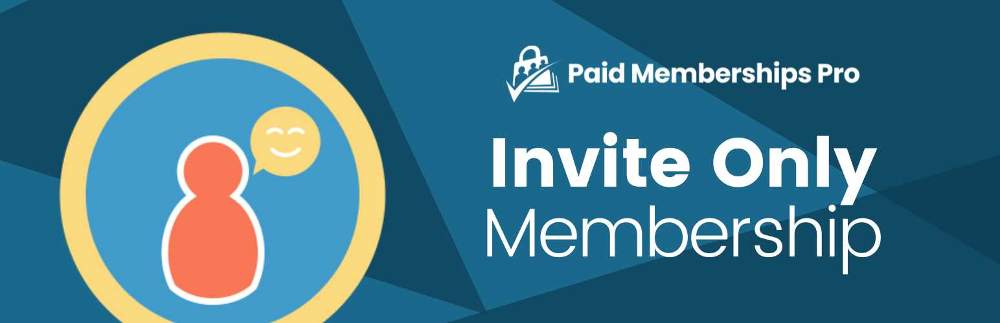

# [Paid Memberships Pro - Invite Only Membership](https://www.paidmembershipspro.com/add-ons/pmpro-invite-only-membership/) #
[comment]: # (Generate badges from shields.io, only works for .org plugins to get other stats etc. We'd have to create our own endpoints for Premium plugins)

### Welcome to the Paid Memberships Pro - Invite Only Membership GitHub Repository
Require an invite code to sign up for the specified Membership Levels (works for free or paid levels). After membership checkout, the member is given invite codes to share.

For more information please visit [www.paidmembershipspro.com/add-ons/pmpro-invite-only-membership/](https://www.paidmembershipspro.com/add-ons/pmpro-invite-only-membership/)

## Installation ##
For detailed installation steps, visit the [documentation](https://www.paidmembershipspro.com/add-ons/pmpro-invite-only-membership/) page.

1. Download the current development ZIP file directly: `https://github.com/strangerstudios/pmpro-invite-only/archive/dev.zip`

**Please ensure that once installing this version of the plugin to remove `-dev` from the plugin's folder name.**

## Bugs ##
If you find an issue/bug, let us know by [creating a detailed GitHub issue](https://github.com/strangerstudios/pmpro-invite-only/issues/new).

## Support ##
This is a developer's portal for Paid Memberships Pro - Invite Only Membership. We do not offer support on this channel. **Any support related questions should be directed to [www.paidmembershipspro.com/add-ons/pmpro-invite-only/](https://www.paidmembershipspro.com/add-ons/pmpro-invite-only-membership/).**

## Contributing to Paid Memberships Pro - Invite Only Membership ##
We encourage and welcome any contribution to Paid Memberships Pro - Invite Only Membership. Please read the [guidelines for contributing](https://github.com/strangerstudios/pmpro-invite-only/blob/dev/.github/CONTRIBUTING.md) to this repository.

There are various **ways to the help development** of Paid Memberships Pro - Invite Only Membership:

1. Report [bugs/issues](https://github.com/strangerstudios/pmpro-invite-only/issues/new) on GitHub.
2. Work on any issues by submitting a Pull Request.

Here are some ways for **non-developers to contribute** to Paid Memberships Pro - Invite Only Membership:

1. Translate Paid Memberships Pro - Invite Only Membership into your own [language](https://www.paidmembershipspro.com/paid-memberships-pro-in-your-language/).
2. [Purchase a paid membership](https://paidmembershipspro.com/pricing) to help fund ongoing development and bug fixes.
3. Leave an honest review for [Paid Memberships Pro - Invite Only Membership](https://wordpress.org/support/plugin/pmpro-invite-only/reviews/#new-post).
